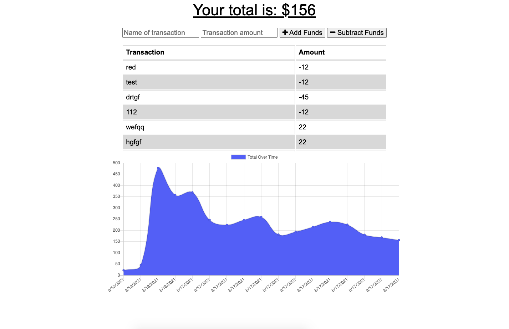

# hw-20

Budget Tracker:
Open the budget tracker app to see a line chart of your budget history, as well as a list of each withdrawal/deposit. To add an additional item simply enter a name and price then click add or subtract. The budget tracker is designed as a progressive web app and so can totally be use offline. As soo as a connection is reestablished, all data will automatically be uploaded to the server.

Created by David Ludwik

The program utilizes a webmainifest and service worker file to cache file data locally so that the app can load offline, making it a pwa. If no connection to the server is available, the fetch calls for all additional transactions are store in que in a local indexed db. Once the connection is reestablished all transaction calls are then made in bulk via an action listener in the db.js file. 

The chart is created via the cart.js library and transactions are handled as entries in a mongodb nosql db according to a mongoose schema. 